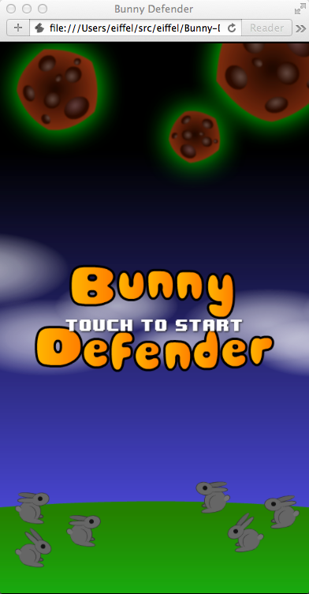

Bunny-Defender
==============

'Bunny Defender' game written with Coffee Script + Phaser framework(phaser.io)

This game was based on Lynda.com's tutorial (http://www.lynda.com/Phaser-tutorials/HTML5-Game-Development-Phaser/163641-2.html), but it was rewritten with coffee script and add Cakefile with minification build process for mobile app.

## Demo Site:  

[Bunny Defender](http://bunny-defender.herokuapp.com/ "Bunny Defender") 

## Prerequisite

    install nodejs/npm from http://www.nodejs.org/

    $ npm install -g coffee-script  # install coffee-script
    $ npm install -g uglifyjs       # install minify tool

## Development

    $ coffee --bare -o js/ -cw src/

## Deployment

    $ cake                      # list task
    $ cake build                # build
    $ cake min                  # minify

## Run

    $ open index.html           # open index.html with Safari, it seemed Google Chrome has some issues to run.
